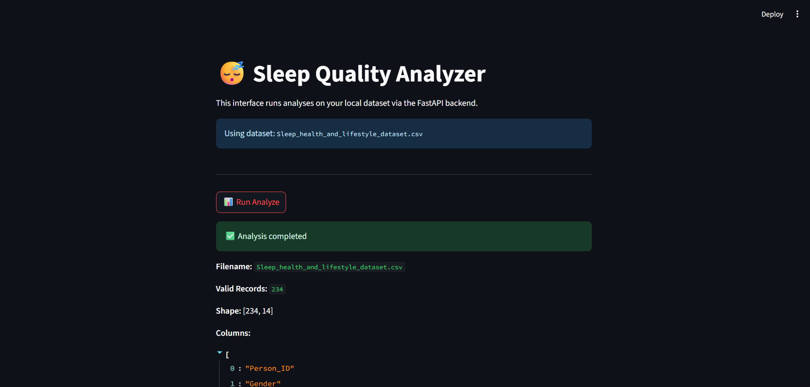

# 😴 Sleep Quality Analysis Microservice

**Sleep Quality Analysis** is a Python-based microservice that performs data analysis, statistical modeling, and diagnostics on sleep and lifestyle data.



---

## 🚀 Features

- ⚙️ **Command-line tools**: Built with `click` for terminal access.
- ⚡ **REST API**: Exposed using `FastAPI`.
- 🎛️ **Streamlit UI**: Visual interface for data exploration and plotting.
- ✅ **Data validation**: Powered by `Pydantic`.
- 📊 **Plotting and Regression**: Uses `matplotlib`, `seaborn`, and `statsmodels`.

---

## 🗂️ Dataset

The project uses the file:

```
Sleep_health_and_lifestyle_dataset.csv
```

It includes the following types of data:

- **Demographics**: Age, Gender, Occupation  
- **Lifestyle metrics**: Physical Activity, Heart Rate, BMI  
- **Sleep metrics**: Duration, Quality, Disorder  
- **Stress levels**: With derived categorical features

---

## 🧱 Project Structure

```
📦 sleep-quality-analysis
 ┣ 📜cli.py                   # Command-line interface
 ┣ 📜main.py                  # FastAPI backend
 ┣ 📜streamlit_app.py         # Streamlit frontend
 ┣ 📜models.py                # Pydantic data validation
 ┣ 📜data_loader.py           # Data loading & cleaning
 ┣ 📂plots/                   # Folder for generated plots
 ┣ 📜Sleep_health_and_lifestyle_dataset.csv
 ┣ 📜sleep_quality-analysis_original.py
 ┣ 📜requirements.txt
 ┣ 📜README.md
```

---

## 💡 Key Capabilities

### 🔍 Analyze

- Cleans and filters the dataset
- Validates structure and types with Pydantic
- Displays:
  - Column names
  - Data types
  - Inferred roles (dependent/independent)

### 📈 Regression

- **Simple Linear**:  
  `Stress_Level ~ Quality_of_Sleep`

- **Multiple Linear**:  
  `Stress_Level ~ Quality_of_Sleep + Age`

- **Non-linear (Quadratic)**:  
  Adds `Quality_of_Sleep²` to model

- **ANOVA**:  
  Compares model fits using ANOVA

### 🧪 Diagnostics

Performs key statistical tests:

- White Test — heteroskedasticity  
- Breusch-Pagan Test — heteroskedasticity  
- Durbin-Watson Test — autocorrelation  
- Jarque-Bera Test — normality of residuals  

### 📊 Plotting

- Histogram & boxplot visualizations (numeric)
- Countplot visualizations (categorical)
- Charts are stored in `plots/`
- If a chart already exists, it’s not regenerated
- Streamlit UI provides plot browsing

---

## ⚙️ Setup & Run (Python < 3.12.0)

### 🔧 Create Virtual Environment

```bash
python -m venv .venv
Set-ExecutionPolicy RemoteSigned -Scope CurrentUser
.\.venv\Scripts\Activate.ps1
pip install -r requirements.txt
```

### 🚀 Run Backend

```bash
uvicorn main:app --reload
```

### 🚀 Run Streamlit UI

```bash
streamlit run streamlit_app.py
```

---

## 👨‍💻 Authors

**Stescu Stefan** & **Alexandru Bardasu**
